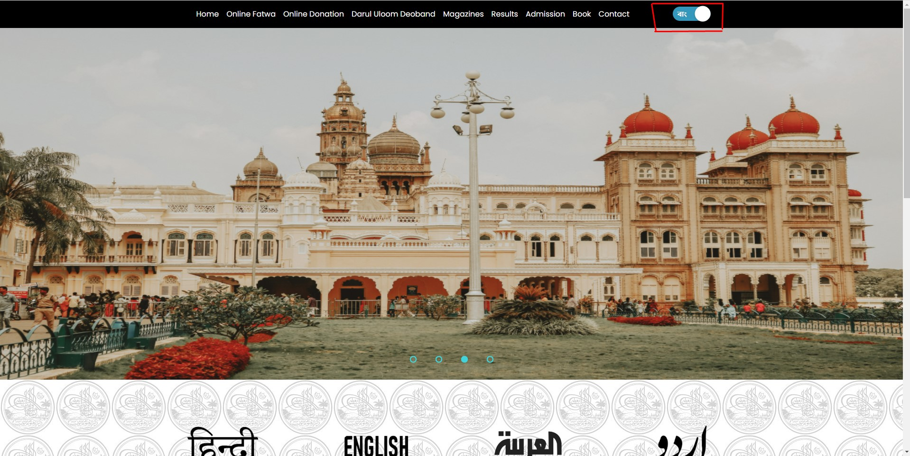

<!-- markdown tutorial -->
Salauddin kamran  
This is second line

----

# Salauddin
## Salauddin
### Salauddin
#### Salauddin
##### Salauddin
###### Salauddin


<p>This is Salauddin kamran. I am 18 years old. I just finished my ssc at Compnygonj Model High School.</p>

### italic text
<br/>

<i>This is an italic text</i>  
_This is an italic text_


### bold text
<br/>
__This is an bold text__

<br/>

### Strikethorugh

~~this is delete text~~ 
### single line code 
`This is inline`  
`<h1>Bangladesh</h1>`  

<br/>

### Multiple line code
```
<htmal>
  <head>
    <title></title>
  </head>
  <body>
    <h1>Salauddin</h1>
  </body>
</html>
```

```html
<html>
  <head>
    <title></title>
  </head>
  <body>
    <h1>Salauddin</h1>
  </body>
</html>
```

```javascript
console.log('hello')
```

```css
head {
  background-color: green;
}
```

### Ol List
<ol>
  <li>list1</li>
  <li>list2</li>
  <li>list3</li>
</ol>

<br/>

### Ordered List
1. Item1
2. Item2
    1. Item1.1
    1. Item1.2
3. Item3

<br/>

### Unordered List
- item 1
- item 2
- item 3
  - item 3.1
  - item 3.2
- item 4
- item 5

<br/>

### Task List
- [x] Task1
- [x] Task1
- [ ] Task1

<br/>

###  Automatic link
https://www.facebook.com/salauddin.kamram/

### Disable link
`https://www.facebook.com/salauddin.kamram/`

### Markdown link syntax
[kamran salauddin](https://www.facebook.com/salauddin.kamram/)

### Markdown link syntax
[kamran salauddin](websitelink)


<!-- all link is here -->
[websitelink]: https://www.facebook.com/salauddin.kamram/

<br/>

###  Image syntax
<!--  -->

😀

<br/>

###  Table syntax
| Name | Email |
|------|--------|
|Anisul Islam | Text is here | 
|Anisul Islam | kamransalauddin186@gmail.com | 
|Anisul Islam | Text is here |
